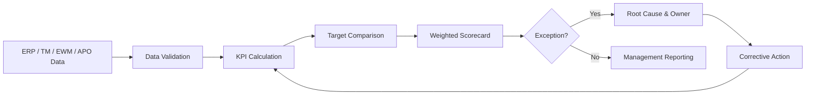

# SAP SCM Logistics Performance Metrics & Evaluation

## Week 5 Internship Project

This repository documents a **logistics performance measurement and evaluation framework using SAP SCM-related concepts**, with emphasis on KPI governance, SAP TM/EWM/APO reporting, simulated operational data, exception analysis and actionable improvement recommendations.

The fictional scenario continues **Deccan Harvest Foods Pvt. Ltd.** and evaluates transportation, warehousing, inventory and service performance over a six-month simulated period.

> **Project type:** Internship planning simulation and SAP reporting/configuration blueprint. It is not presented as a live productive-system implementation.

## Final Report

📄 [**Open the Week 5 Optimized Word Report**](docs/SAP_SCM_Week5_Performance_Metrics_Evaluation_Hrudhai_Optimized.docx)

## Project Objective

The project demonstrates how logistics performance can be measured systematically by defining KPI formulas, targets, owners, data sources, review frequencies and escalation rules.

The framework covers:

- service and delivery performance
- transportation utilization and cost
- warehouse execution quality
- inventory availability and accuracy
- weighted scorecard evaluation
- exception monitoring and escalation
- data validation and governance
- improvement prioritization

## KPI Framework

| KPI | Baseline | Target / Improved Level | Purpose |
|---|---:|---:|---|
| OTIF | 89% | 96% | Customer service reliability |
| Order accuracy | 96.5% | 99% | Fulfilment quality |
| Inventory turnover | 7.2x | 9.0x | Working-capital efficiency |
| Truck utilization | 70.3% | 93.75% | Transport efficiency |
| Pick accuracy | 97.2% | 99.5% | Warehouse quality |
| Dock turnaround | 110 min | 75 min | Dock productivity |
| Stock-out rate | 7.5% | 2.4% | Product availability |
| Freight cost / tonne | ₹2,150 | ₹1,825 | Logistics cost efficiency |
| Order cycle time | 3.6 days | 2.5 days | Responsiveness |
| Inventory accuracy | 94% | 99% | Planning-data reliability |

See [`docs/kpi-framework.md`](docs/kpi-framework.md).

## Measurement Methodology

1. Define each KPI and formula.
2. Identify source transactions and reporting fields.
3. Validate data completeness and time stamps.
4. Calculate monthly KPI results.
5. Compare actuals with target thresholds.
6. Apply KPI weights to obtain a composite score.
7. Classify exceptions by severity and root cause.
8. Assign owners and corrective actions.
9. Review trends and validate improvement effects.
10. Retain evidence for governance and auditability.



## Simulated Performance Findings

The six-month simulation shows how operational improvement initiatives can affect both individual KPIs and the overall scorecard.

Key modeled improvements include:

- OTIF improves from **89% to 96%**.
- Truck utilization improves from **70.3% to 93.75%**.
- Dock turnaround improves from **110 to 75 minutes**.
- Stock-out rate reduces from **7.5% to 2.4%**.
- Freight cost reduces from **₹2,150 to ₹1,825 per tonne**.
- Composite logistics score improves from approximately **83.1 to 99.8 out of 100**.

The illustrative freight-cost improvement corresponds to approximately **₹25.35 lakh annualized savings** under the report assumptions.

See [`docs/simulation-analysis.md`](docs/simulation-analysis.md).

## SAP Reporting Concepts Applied

| Area | Reporting / monitoring concept |
|---|---|
| SAP TM | Freight-order, transport execution and operational analytics concepts |
| SAP EWM | Warehouse Monitor, execution KPIs and warehouse activity analysis |
| SAP ERP | Order, delivery, inventory and financial source data |
| SAP APO / SCM | Alert Monitor and planning-exception concepts |
| Enterprise reporting | BW / ODP / CDS / dashboard layer depending on landscape |

The report treats the exact reporting architecture as landscape-dependent and focuses on a practical integration blueprint rather than claiming live configuration.

## Improvement Priorities

The 90-day roadmap concentrates on:

- carrier appointment discipline
- wave-to-departure synchronization
- transport load consolidation
- inventory exception management
- stock-out root-cause control
- master-data and timestamp validation
- KPI ownership and escalation discipline

See [`docs/recommendations.md`](docs/recommendations.md).

## Validation & Governance

The project includes ten validation tests covering formula accuracy, missing records, duplicate data, timestamp logic, unit consistency, target thresholds, score weighting and reconciliation with source totals.

Governance assigns responsibility for data ownership, KPI review, exception handling, corrective action and management reporting.

See [`docs/validation-governance.md`](docs/validation-governance.md).

## Repository Structure

```text
SAP-SCM-Logistics-Performance-Metrics-Evaluation/
|
|-- README.md
|-- docs/
|   |-- SAP_SCM_Week5_Performance_Metrics_Evaluation_Hrudhai_Optimized.docx
|   |-- kpi-framework.md
|   |-- simulation-analysis.md
|   |-- recommendations.md
|   `-- validation-governance.md
|
`-- diagrams/
    |-- measurement-cycle.md
    |-- reporting-data-flow.md
    `-- escalation-flow.md
```

## Supporting Diagrams

- [`KPI Measurement Cycle`](diagrams/measurement-cycle.md)
- [`Reporting Data Flow`](diagrams/reporting-data-flow.md)
- [`Exception Escalation Flow`](diagrams/escalation-flow.md)

## Learning Outcomes

This project strengthened my understanding that KPI reporting is useful only when the underlying definition, data source, ownership and action process are clear. It also showed how service, inventory, warehouse and transportation metrics must be evaluated together because improvement in one area can create trade-offs in another.

## Author

**Hrudhai Prem Kumar Patwari**  
SAP SCM / SAP MM Learner | IT Operations Professional

---

### Academic / Internship Use

All company names, quantities, performance values and financial results in this repository are fictional and are used only for learning, analysis and internship submission purposes.
