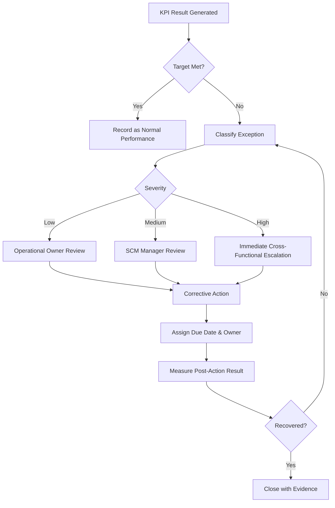

# Exception Escalation Flow

```mermaid
flowchart TD
    A[KPI Result Generated] --> B{Target Met?}
    B -- Yes --> C[Record as Normal Performance]
    B -- No --> D[Classify Exception]
    D --> E{Severity}
    E -- Low --> F[Operational Owner Review]
    E -- Medium --> G[SCM Manager Review]
    E -- High --> H[Immediate Cross-Functional Escalation]
    F --> I[Corrective Action]
    G --> I
    H --> I
    I --> J[Assign Due Date & Owner]
    J --> K[Measure Post-Action Result]
    K --> L{Recovered?}
    L -- Yes --> M[Close with Evidence]
    L -- No --> D
```

The flow links KPI monitoring with accountable corrective action. Severity can be based on customer impact, financial impact, persistence and operational risk.
