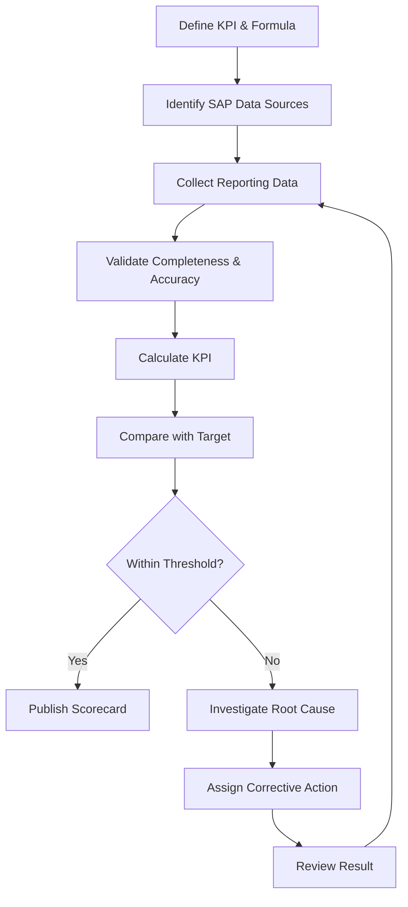

# KPI Measurement Cycle

This cycle represents the control logic used in the Week 5 performance framework. KPI calculation is treated as part of a continuous management process rather than a one-time reporting activity.
