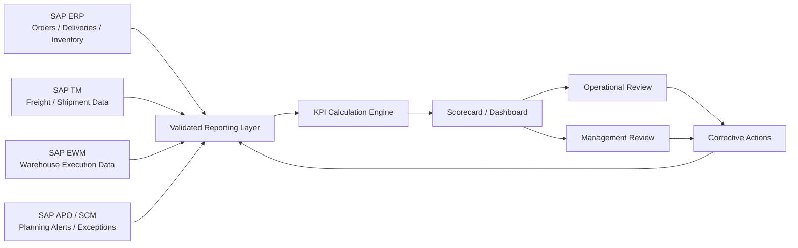

# Reporting Data Flow

The diagram is conceptual. The precise technical path can vary by SAP landscape and may use operational analytics, BW, ODP/CDS extraction or another enterprise reporting layer.
